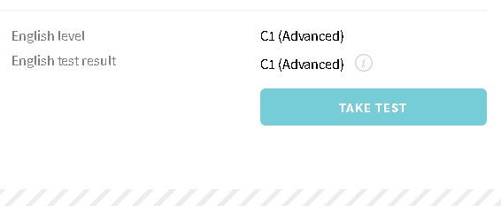

# Mykhailo Artemenko


## Trainee Front-end engineer

### Contact information:
*  **Phone:** +38 (099) 195-81-31;
*  **E-mail:** artemenko.mik@gmail.com;
*  **Telegram:** [@domino_sl](https://t.me/domino_sl);
*  **LinkedIn:** [Mykhailo Artemenko](www.linkedin.com/in/mykhailo-artemenko);

### About:
  I am your typical guy who wants to enter the world of informational technologies, having almost nothing in common with it. I won't say that I have made a wrong turn with my current profession, it's just that I find myself lacking problem-solving delight.

### Education:
  * National Aviation University;
    * Maintenance and repair of aircraft and aircraft engines;
  * SoftServe:
    * HTML/ CSS/ Javascript basics;
  * Mate academy:
    * Front-end engineer bootcamp;

### Skills:
* a little bit of html;
* a pinch of css;
* and a fraction of javascript;

### Code examples:
#### [Directions Reduction task from codewars](https://www.codewars.com/kata/550f22f4d758534c1100025a)
````
function dirReduc(arr){
  const directionPairs = {
    "NORTH": "SOUTH",
    "SOUTH": "NORTH", 
    "EAST": "WEST",
    "WEST": "EAST",
  }
  const result = [];

  for (const direction of arr) {
    if (result[result.length - 1] === directionPairs[direction]) {
      result.pop(); 
    } else {
      result.push(direction);
    }
  }

  return result;
}
````

### Experience:
  Still in pursuit for that commercial treasure.

### English language tested by EPAM:

