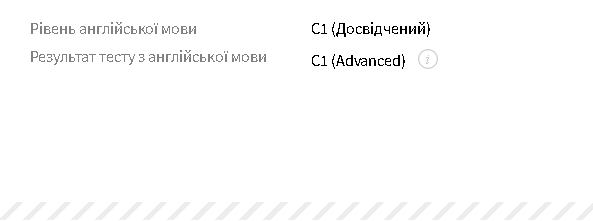

# Mykhailo Artemenko


## Junior Front-end engineer

### Contact information:
*  **Phone:** +38 099 195-81-31;
*  **E-mail:** artemenko.mik@gmail.com;
*  **Telegram:** [@domino_sl](https://t.me/domino_sl);
*  **LinkedIn:** [Mykhailo Artemenko](www.linkedin.com/in/mykhailo-artemenko);

### About me:
  I am your typical guy who wants to be a switcher. I won't say that I have made a wrong turn with my current profession. It's just that I find myself lacking problem-solving delight.

### Education:
  * National Aviation University;
    * Maintenance and repair of aircraft;
  * SoftServe:
    * HTML/ CSS/ Javascript basics;
  * Mate academy:
    * Several month on their training app;
### Skills:
* a little bit of html;
* a pinch of css;
* and a fraction of javascript;

### Code examples:
#### [Directions Reduction task from codewars](https://www.codewars.com/kata/596f610441372ee0de00006e)
````
function dirReduc(arr){
  const directions = {
    "NORTH": "SOUTH",
    "SOUTH": "NORTH", 
    "EAST": "WEST",
    "WEST": "EAST",
  }
  const result = [];

  for (const dir of arr) {
    if (result[result.length - 1] === directions[dir]) {
      result.pop(); 
    } else {
      result.push(dir);
    }
  }

  return result
}
````

#### [Basic DeNico task from codewars](https://www.codewars.com/kata/596f610441372ee0de00006e)
````
const nico = (key, m) => { 
  const code = key.split('').sort().map(el => key.indexOf(el))

  let words = [];

  for (let i = 0; i < m.length; i += key.length) {
    words.push(m.slice(i, i + key.length))
  }

  words = words.map(word => code.map(pos => word[pos] ? word[pos] : ' '))

  return words.map(word => word.join('')).join('');
}
````

### Experience:
  Still in pursuit for that commercial treasure.

### English language tested by EPAM:

